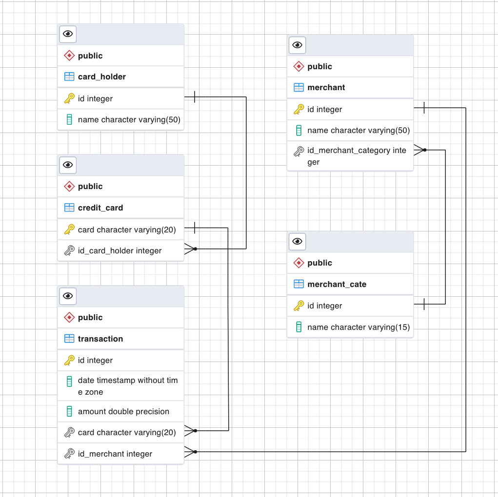
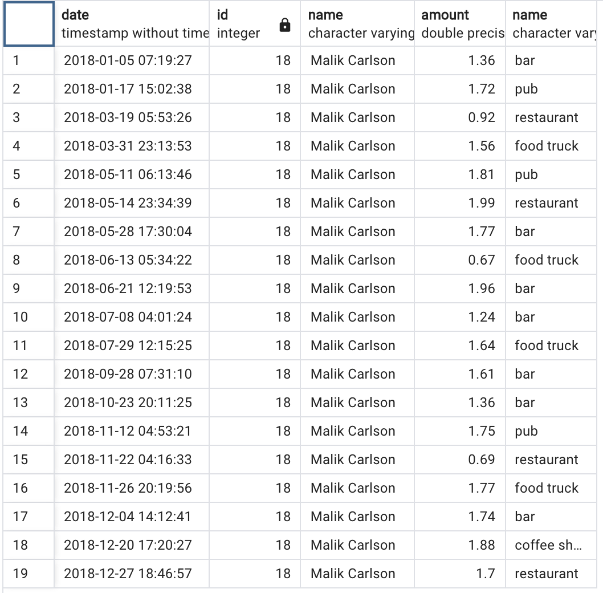

# Module_7_Challenge
# SQL Fraud detection assignment.
## Background and overview

In this homework assignment, I have had to use SQL skills to analyze historical credit card transactions and consumption patterns in order to identify possible fraudulent transactions.

The three main tasks to accomplish are:

 1. Data Modeling: Define a database model to store the credit card transactions data and create a new PostgreSQL database using your model.

 2. Data Engineering: Create a database schema on PostgreSQL and populate your database from the CSV files provided.

 3. Data Analysis: Analyze the data to identify possible fraudulent transactions trends data, and develop a report of your observations.

 This Markdown report of the below findings is to presented to the CFO of the company.

## Data Modelling
Initally I viewed and understood the csv files and their relationships before importing and modelling. The csv files were imported as per the below ERD table which shows the interdependancies. Primary and Foreign Keys had to be constucted to achieve this table.

Table 1: Schema graph of imported card_holder, credit_card, merchant,merchant_category & transaction csv's.

## Data Analysis
### Part 1:
I have isolated (or grouped) the tranactions of cardholders 2 and 18.

I also counted the transactions that were less than $2.00 per cardholder and of the total 30, only 11 were from Shane Shaffer, card id 2. Only three of these transactions were early (1:00 and 3:00am) and there was no transactions over $20. There was no obvious deviation in amounts and therefore conclude this card does not demostrate any fraudulant activity in this data period.

 Of the other 19 transactions from Malik Carlsons cards, card id 18, eight tranactions less than $2:00 were undertaken between the hours of 4:00am and 8:00am which is  suspicious card activity. Notably this card had three outliers to be further investigated. Two transactions were late evening tranactions of over $1800 for a restaurant and a pub which may be legitimate however the 5:30am transaction of $1769.0000000000002 was traced to a food truck. The timing of this transaction and the business type should be highted and note the extensive decimal placing of this transaction. I believe the evidence found here that suggest that card id 18 has been hacked.

 I then linked the merchant id's and merchant categories into the data set and found another three suspicous transactions and clear outliers. They were card 7, Sean Taylor for $1685.0000000000002, and card 6, Beth Hernandez for $2001.0000000000002 and $1855.9999999999998, in addition to the Malik Carlson transaction highlighted above. Further evidence of hacking of card 18 was present when merchant categories were reveiled.

I then also looked at the time of these transactions which was 3:05am, 6:17am, 3:15pm and 5:30am respectivley. The timing, amounts and the merchant categories all presents evidence of fraudulant activity on these cards. Card 18 for example had small transactions of less than $2.00 between 7:00am and 9:00am at pubs and bar locations included in the eight questionable transactions between 4:00am and 8:00am before mentioned.

the top 100 transactions made between 7:00am and 9:00am were...
do you see and anomalous transactions that could be fraudulant?
Is there a higher number of fraudulent transactions made during this time frame versus the rest of the day?

If you answered yes to the previous question, explain why you think there might be fraudulent transactions during this time frame.

What are the top 5 merchants prone to being hacked using small transactions?
Create a view for each of your queries.

### Part 2:
Your CFO has also requested detailed trends data on specific card holders. Use the starter notebook to query your database and generate visualizations that supply the requested information as follows, then add your visualizations and observations to your markdown report:

The two most important customers of the firm may have been hacked. Verify if there are any fraudulent transactions in their history. For privacy reasons, you only know that their cardholder IDs are 2 and 18.
Using hvPlot, create a line plot representing the time series of transactions over the course of the year for each cardholder separately.

Next, to better compare their patterns, create a single line plot that contains both card holders' trend data.

What difference do you observe between the consumption patterns? Does the difference suggest a fraudulent transaction? Explain your rationale.

The CEO of the biggest customer of the firm suspects that someone has used her corporate credit card without authorization in the first quarter of 2018 to pay quite expensive restaurant bills. Again, for privacy reasons, you know only that the cardholder ID in question is 25.
Using hvPlot, create a box plot, representing the expenditure data from January 2018 to June 2018 for cardholder ID 25.

Are there any outliers for cardholder ID 25? How many outliers are there per month?

Do you notice any anomalies? Describe your observations and conclusions.

